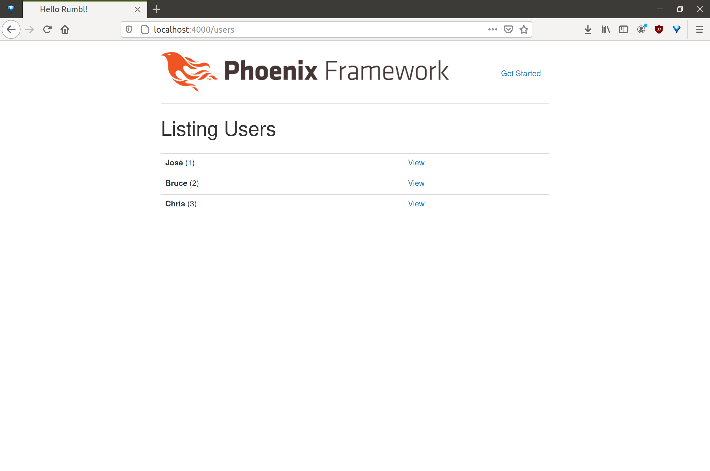

# Rumbl

To start your Phoenix app:

  * Install dependencies with `mix deps.get`
  * Create and migrate your database with `mix ecto.create && mix ecto.migrate`
  * Install Node.js dependencies with `npm install`
  * Start Phoenix endpoint with `mix phoenix.server`

Now you can visit [`localhost:4000`](http://localhost:4000) from your browser.

## Commands

initial setup

```bash
$ mix phoenix.new . --app rumbl
$ mix ecto.create
$ mix phoenix.server
```

## Users

```bash
$ iex -S mix
> alias Rumbl.User
> alias Rumbl.Repo
> Repo.all(User)
> Repo.get(User, "1")
> Repo.get_by(User, name: "Chris")
```

## Editor


## Browser



---

## Editor (show user)


## Browser (show user)


